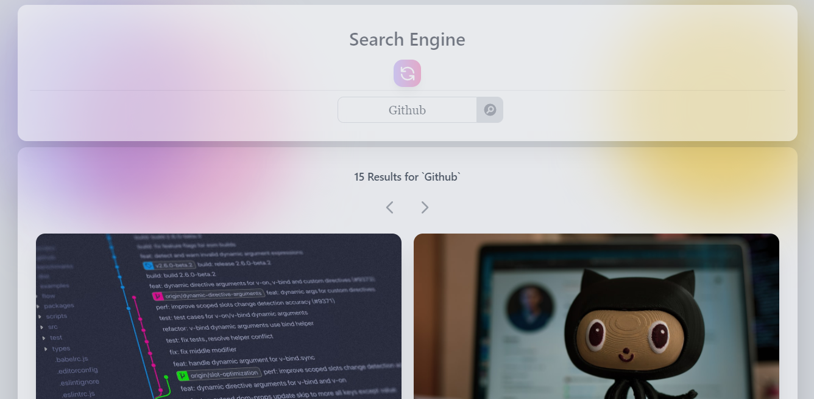

# Unsplash - Photo Search Engine 

Responsive Image Search Engine Created With Vue Js

> [Live Preview](https://search-engine-vue.netlify.app/)

## Installation
```
# clone repo
git clone https://github.com/mohsin-riad/unsplash-search-engine.git

# install dependencies
npm install

# serve with hot reload at localhost:8080
npm run serve
```

---
## Contributing Rules

Thanks for your interest!

> To contribute, please ensure that you have stable(LTS) Node.js and npm installed.

Follow the steps below.

1. Follow the [Installing](#Installation) instructions
2. Check the open issues out
3. Create your branch with a reference to the open issue
4. Commit your changes
5. Open a pull request

If you have any questions, feel free to email me at [mohsin.riad.cse@gmail.com](mohsin.riad.cse@gmail.com)

--- 
## Screenshot



---
## Build
> install Node Js(v8 engine) | dependency manager (npm)
* setup: [NodeJs LTS](https://nodejs.org/en/download/)
``` bash
# select: vue 3, vue router, vuex
vue create unsplash-search-engine
```

### Tailwind integration
* setup: [Tailwind-css](https://tailwindcss.com/docs/installation)
``` bash
# Generate tailwind.config.js >full
vue add tailwind 
```

### Axios integration
> used to sent POST and GET request to the server
``` bash
# individual project integration
npm i axios --save
```
> Add to:  ``` src/main.js ```
``` bash
import axios from 'axios'
```

## Compiles and hot-reloads for development
``` bash
npm run serve
```

### Customize configuration
* See [Configuration Reference](https://cli.vuejs.org/config/).